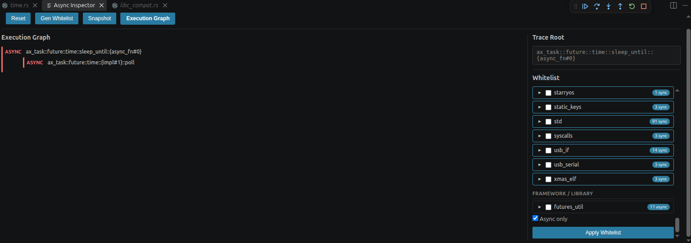

# K3 异步调试链路闭环


前面阶段已经让 StarryOS 在 K3 COM260 上跑了起来，也把 ARD 接到了 K3 上。Rust 源码断点、调用栈读取和 Step Over（单步跳过）都已经验证成功。

所以这一阶段，继续验证：
**ARD 能不能看见 StarryOS 里真正运行的 Rust 异步任务，把执行过程和父子关系展示出来？**

最终，这件事已经在本轮 sleep 2 工作负载中跑通了：白名单能生成，真实运行事件能记录，History 有内容，Snapshot 不再为空，Async Inspector 也能显示两层异步执行关系。验证过程中，还顺手补上了一个功能：**Async only，只把选中的异步函数加入白名单。**

---

## 验证环境

这一阶段启动仍然遵循已经确认的条件：先完成一次厂商启动和 RCPU / RPMI 初始化，保持供电，再通过 warm recovery（不断电的热重启恢复流程）进入 Debug Golden Flow，启动 Host-DWARF StarryOS。

这里的 Host-DWARF，还是之前的做法：**板子运行正常大小的 release BIN，源码调试信息留在电脑端的 ELF 中，两者必须来自同一次构建。**

本轮环境如下：

| 项目 | 当前配置 |
|---|---|
| 开发板 | SpacemiT K3 COM260 |
| 操作系统 | StarryOS |
| 指令集 | RISC-V 64 |
| 调试器 | ARD |
| GDB | gdb-multiarch |
| 硬件调试通道 | OpenOCD + J-Link + JTAG |

ARD / GDB 使用的 Host-DWARF ELF：

```text
/home/user/ARD_Deploy/deployment_baselines/K3_COM260_StarryOS_DWARF_Debug_Verified/artifacts/starryos/starryos_host_dwarf_release.elf
```

ARD 开发仓库与分支保持不变：

```text
repo: /home/user/async-integration/async-debug
branch: async-integration
```

---

## 找到可观察的异步函数

第一步是在 K3 StarryOS 的 Host-DWARF ELF 上执行 Gen Whitelist。

这个操作就是**先扫描调试符号，整理出“有哪些函数可以选来观察”的名单。** 它会按照 crate（Rust 的代码包）分类，并区分 async 和 sync 函数。

一次典型输出是：

```text
[ARD] wrote grouped whitelist:
100 crates (99 user),
6296 symbols (77 async, 6219 sync)
```

不同调试会话里，同步符号总量有一定波动，但这轮识别到的异步候选数稳定为：

```text
77 async symbols
```

生成的两个文件分别是：

```text
tgoskits/temp/poll_functions_grouped.json
tgoskits/temp/poll_functions.txt
```

它们的分工不同：

| 文件 | 作用 |
|---|---|
| poll_functions_grouped.json | 保存 crate、symbol、source、kind 等分类结果，供界面选择 |
| poll_functions.txt | 保存最终选中的函数，是运行时真正加载的白名单 |

同时需要注意：**Gen Whitelist 完成后，默认的运行时白名单仍然为空，还需要进一步 Apply。** 找到候选函数，并不等于已经开始观察所有函数。

---

## 选择可反复触发的验证对象

有了 77 个 async 候选以后，先选了 ax_task 作为第一轮实验对象。

它的分类结果是：

```text
ax_task:
total = 202
async = 2
sync = 200
```

其中两个 async symbol 是：

```text
ax_task::future::time::{impl#1}::poll
ax_task::future::time::sleep_until::{async_fn#0}
```

对应源码位于：

```text
os/arceos/modules/axtask/src/future/time.rs
```

继续沿着 StarryOS 的路径往下看，确认用户态睡眠请求最终会进入异步 sleep 路径。涉及的关键调用包括：

```text
sys_nanosleep
sleep_impl
block_on(interruptible(sleep(dur)))
ax_task::future::time::sleep
sleep_until(...).await
TimerFuture::poll
```

所以第一轮真板验证选用的工作负载很简单，在 StarryOS shell 中执行：

```text
sleep 2
```

这样既容易重复，也能让我们选中的异步路径真正运行起来。

---

## History 和 Snapshot

第一轮只安装一个 Observer，也就是一个运行时观察点：

```text
ax_task::future::time::sleep_until::{async_fn#0}
```

加载结果是：

```text
[ARD] whitelist loaded:
exact=1
prefix=0
observers=1
```

这里的 exact=1 表示精确匹配一个符号，prefix=0 表示没有使用前缀匹配。

随后把同一个函数设为 Trace Root，也就是当前观察视图的根，再到 StarryOS shell 执行 sleep 2。

于是History 中出现了运行记录：

```text
func = ax_task::future::time::sleep_until::{async_fn#0}
origin = runtime-event
semantic_kind = future_poll
admission_action = ALLOW
admission_reason = whitelist_runtime_execution_hit
```

同时记录到了实际的函数进入和退出事件：

```text
call_enter
call_exit
```

这一步证明：**这个函数在 K3 板上执行过的记录。**  精确 Observer、RuntimeEvent（运行事件）和 History（执行历史）验证通过。

接下来查看 Snapshot ，它负责展示当前暂停时的快照。

在这轮真实运行事件产生后，Snapshot 恢复了非空的异步路径：

```text
empty = false
```

识别到的 Future 是：

```text
ax_task::future::time::sleep_until::{async_fn#0}
```

从 DWARF 调试信息中恢复出的类型是：

```text
ax_task::future::time::sleep_until::{async_fn_env#0}
```

同时获得了：

```text
future_type_source = dwarf
poll.status = ok
poll.source = dwarf
active = true
```

源码也成功定位到：

```text
os/arceos/modules/axtask/src/future/time.rs:129
```

这说明，在当前验证对象上，ARD 已经能把真板运行中的 Future、DWARF 类型、poll 状态和源码位置对应起来，并恢复当前活跃的异步路径。


---

## 增加观察点

一个 Future 能看见以后，我们继续把第二个异步函数加进来。

第二轮使用两个精确 Observer：

```text
0 ax_task::future::time::sleep_until::{async_fn#0}
1 ax_task::future::time::{impl#1}::poll
```

加载结果：

```text
exact = 2
prefix = 0
observers = 2
```

再次执行 sleep 2 后，History 得到了：

```text
nodes = 2
edges = 1
roots = 1
events = 5
```

简单说，就是有两个节点、一条连接关系、一个根节点，以及五个运行事件。

Child 节点还明确记录了父节点及关系来源：

```text
parent_func = ax_task::future::time::sleep_until::{async_fn#0}
parent_source = recent_root_thread
edge_status = accepted
event_gap = 1
```

恢复出来的两层关系如下：

| 层级 | 函数 |
|---|---|
| 父节点 | ax_task::future::time::sleep_until::{async_fn#0} |
| 子节点 | ax_task::future::time::{impl#1}::poll |

说明 **ARD 可以在本轮真板事件中建立两层 async 父子关系。** 关系来源保留在 parent_source 等字段中，便于回看建立过程。

---

## Inspector界面

后端数据正确后，还要确认这些结果在 Async Inspector 中展示。

继续以 sleep_until::{async_fn#0} 作为 Trace Root ，Observer Tree 从 History 中投影出了相同的两层结构，Execution Graph UI 也显示了对应的父子节点。




 图中可以看到 sleep_until::{async_fn#0} 与 ax_task::future::time::{impl#1}::poll 的两层异步执行关系。

图中这几个组件各有分工：

| 组件 | 本轮验证中的作用 |
|---|---|
| RuntimeEvent | 记录真板上实际发生的运行事件 |
| History | 保存事件及节点、关系等执行历史 |
| Snapshot | 查看当前暂停时的异步状态 |
| Observer Tree | 按选定 Trace Root 展示 History 中的关系 |
| RuntimeEventGraph | 表达运行事件形成的节点和连接关系 |
| Execution Graph UI | 在 Async Inspector 中把关系展示出来 |


本轮验证把“真板实际执行—后端记录—关系恢复—界面展示”接起来了。

---

## 只把 async 函数加入白名单


原有 Apply Whitelist 按 crate 选择。以使用的 ax_task 为例：

```text
202 total
2 async
200 sync
```

里面有 2 个异步函数和 200 个同步函数，这些都会一起进入运行时白名单。

但如果只想观察异步函数。把其他函数也装成 Observer，会增加观察点数量、运行开销和无关信息。

于是补上一个小功能：

```text
[ ] Async only
```

**只把已经选中 crate 里的 async 函数加入白名单。**

这个选项默认关闭，关闭时保持原来的 Apply 行为；开启后，只保留已有 grouped whitelist 中 kind == "async" 的符号。

| 选项状态 | Apply Whitelist 的结果 |
|---|---|
| Async only 关闭 | 加入所选 crate 的全部 symbols |
| Async only 开启 | 只加入所选 crate 中 kind == "async" 的 symbols |

它直接复用：

```text
poll_functions_grouped.json
```

不会重新扫描 ELF，也不会再额外生成一份候选函数名单。

实现以后，在 Async Inspector 中选中 ax_task，打开 Async only，再点击 Apply Whitelist。

输出变成：

```text
[ARD] whitelist updated:
1 crates enabled,
2 symbols,
observers=2,
async_only=true
```

随后加载结果为：

```text
[ARD] whitelist loaded:
exact=2
prefix=0
observers=2
```

实际生成的文件：

```text
/home/user/ARD_Deploy/tgoskits/temp/poll_functions.txt
```

确实只包含两条 async symbol：

```text
0 ax_task::future::time::{impl#1}::poll
1 ax_task::future::time::sleep_until::{async_fn#0}
```

没有把同一个 crate 里的 200 个同步符号一起带进来。

接着再次执行 sleep 2，Execution Graph 仍然能恢复。

这一步同时验证了两件事：

- Async only 确实筛出了我们想要的两个异步函数；
- 筛选后，原本已经跑通的 RuntimeEvent、History、Observer Tree 和 Execution Graph 链路仍然正常。

---


## 本阶段完成的工作与贡献

这一阶段主要完成了四件事。

1. **把已有异步观察能力放到了真实 K3 环境中验证。** 从 Host-DWARF ELF 生成白名单，再用 StarryOS 的 sleep 2 触发实际异步路径，确认记录来自真板执行，而不只是静态符号。

2. **把单 Future 的观察推进到了两层关系和界面展示。** History 记录到节点和事件，Snapshot 恢复出 Future 类型、poll 状态与源码位置，Observer Tree 和 Execution Graph 显示出同一组父子关系。

3. **补上 Async only 白名单筛选。** 复用现有 grouped whitelist 的 kind 字段，让用户在选择 crate 后只加载 async 函数，保留默认关闭时的兼容行为。

4. **完成测试、真板回归和提交。** Async only 不只是写好了界面选项，而是已经验证到运行时白名单和最终 Execution Graph，并完成代码推送。

其中，前两项主要是在 K3 上验证 ARD 已有能力；Async only 是本阶段新增的功能。两者一起构成了这次阶段收尾的成果。

---

## 当前阶段结果

验证结果汇总如下。这里的 PASS 对应本轮已记录的环境和测试范围：

| 能力 | 状态 |
|---|---|
| K3 ARD 基础连接 | ✅ PASS |
| Host-DWARF 源码调试 | ✅ PASS |
| Gen Whitelist | ✅ PASS |
| Async symbol 识别 | ✅ PASS |
| 精确 Runtime Observer | ✅ PASS |
| RuntimeEvent | ✅ PASS |
| History | ✅ PASS |
| Snapshot 非空异步路径 | ✅ PASS |
| DWARF Future 类型恢复 | ✅ PASS |
| Observer Tree | ✅ PASS |
| 本轮两层 async 父子关系 | ✅ PASS |
| RuntimeEventGraph | ✅ PASS |
| Execution Graph UI | ✅ PASS |
| Async only UI | ✅ PASS |
| Async only 运行时筛选 | ✅ PASS |
| Async only K3 端到端回归 | ✅ PASS |

对应的阶段结果标记保留如下，便于与原始验证记录对照：

```text
K3_STARRYOS_WHITELIST_GENERATION_VERIFIED = PASS
K3_STARRYOS_WHITELIST_OBSERVERS_VERIFIED = PASS
K3_STARRYOS_RUNTIME_EVENT_VERIFIED = PASS
K3_STARRYOS_HISTORY_VERIFIED = PASS
K3_STARRYOS_SNAPSHOT_VERIFIED = PASS
K3_STARRYOS_ASYNC_PARENT_CHILD_VERIFIED = PASS
K3_STARRYOS_RUNTIME_EVENT_GRAPH_VERIFIED = PASS
K3_STARRYOS_OBSERVER_TREE_VERIFIED = PASS
K3_STARRYOS_ASYNC_EXECUTION_GRAPH_UI_VERIFIED = PASS
K3_STARRYOS_ASYNC_RUNTIME_END_TO_END_VERIFIED = PASS
K3_ASYNC_ONLY_WHITELIST_UI_VERIFIED = PASS
K3_ASYNC_ONLY_FILTER_VERIFIED = PASS
K3_ASYNC_ONLY_RUNTIME_REGRESSION = PASS
K3_ASYNC_ONLY_WHITELIST_END_TO_END_VERIFIED = PASS
STAGE4_K3_ARD_ASYNC_RUNTIME = PASS
```

因此 **ARD 已经能够在 K3 真板上观察本轮 StarryOS 异步路径，记录真实事件，恢复 Future 状态与两层父子关系，并在 Async Inspector 中展示执行图。**

---


## 下一阶段

下一阶段是另一个问题： **ARD 能不能进一步在 K3 + StarryOS 上识别操作系统的 kernel/user 状态转换？**

也就是用户程序进入内核、再返回用户态时，OSStateMachine（操作系统状态机）能否跟上真实执行过程。